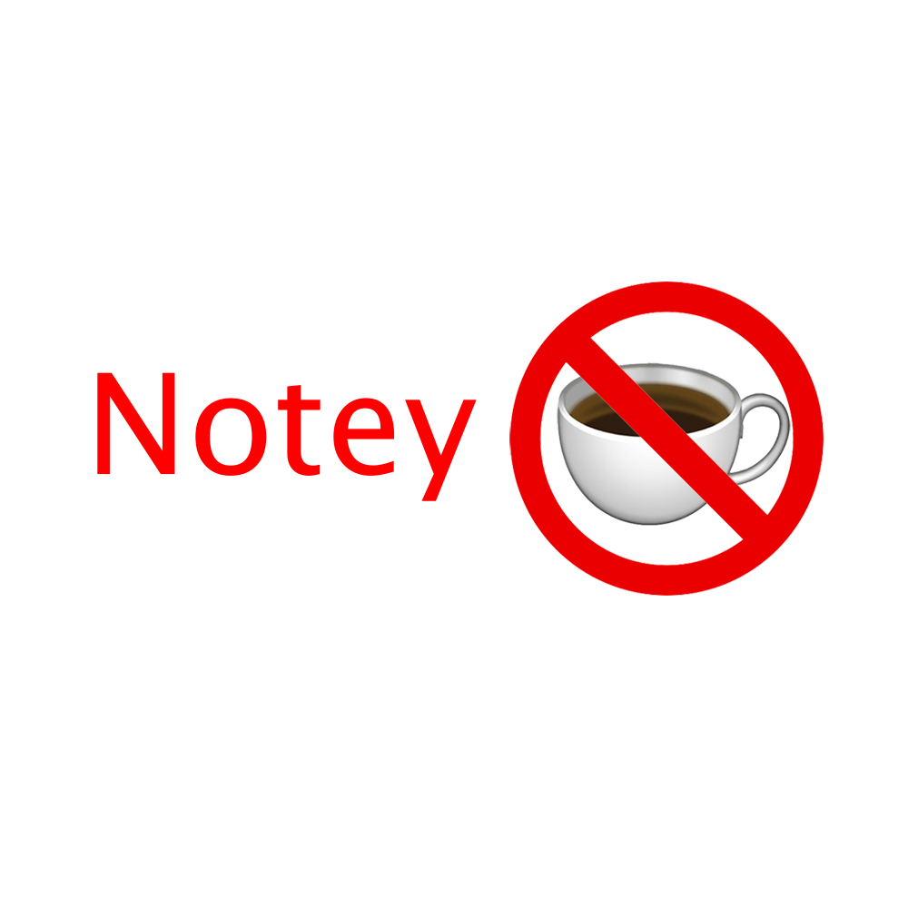

<h1><ins><b><i>DESCLAIMER: I AM IN NO WAY HOLDING ANY RESPONSIBILITY FOR ANYTHING THE USER DECIDES TO USE THIS PROJECT FOR.</b></i></ins></h1>

<h1>Notey!</h1>
This tweak adds a floating button like the stock accessibility button, except this new button is ~~unstable and changes position over time. please make a pr to fix it i tried to many different approaches and this is the best i could come up with~~ opens your notes! Not the stock Apple notes app, but notes!

For any bugs/feature requests, either file an issue or join the [Discord server](https://discord.gg/mZZhnRDGeg) (I check the Discord server more often, just saying)!

<h2>To-Do List</h2>
- [ ] Fix the floating button position somehow. PRs are more than welcomed
- [ ] Markdown
- [ ] Images support
- [ ] Lists support (like `•` at the beginning of lines or `1.` (I have no clue how it's called))
- [ ] Long press the floating button to make a new note (quick-note)

<h2>Contributing</h2>
Yes please. Just file PRs with your desired changes, with prior testing please! If you haven't tested it first, just say that it's untested

<h2>Credits</h2>
<li>Thanks to Herpa for suggesting this tweak and giving me more ideas for improvements, and suggesting this icon. My icon idea was NT in red over a semi-transparent white...</li>
<li>Thanks to whoever made the tea emoji and no-access emoji cause my icon is basically the two of them on top of each other</li>
<li>Thanks to anyone who worked on LibGcUniversal</li>
<li>Thanks to anyone who worked on Cephei</li>
<li>Thanks to anyone who worked on Alderis</li>
<li>Thanks to [0xkuj](https://github.com/0xkuj/) for finding a way to fix the delay with the CC being dismissed</li>